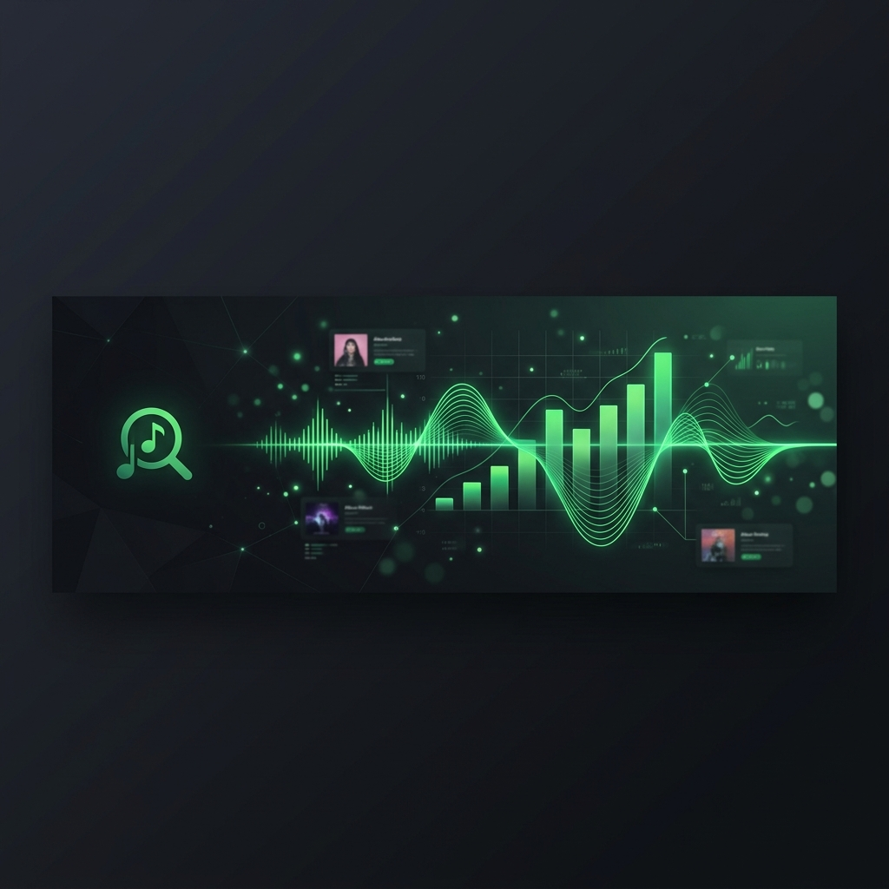
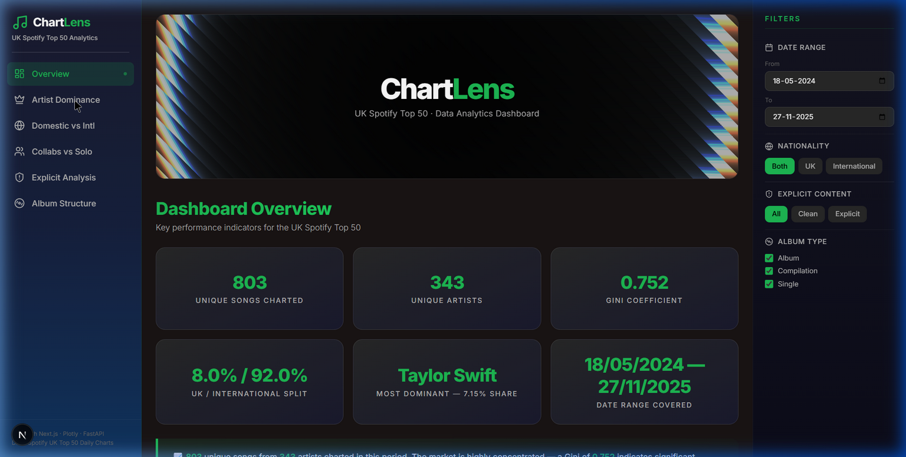
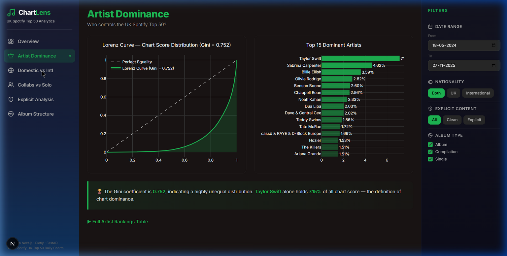
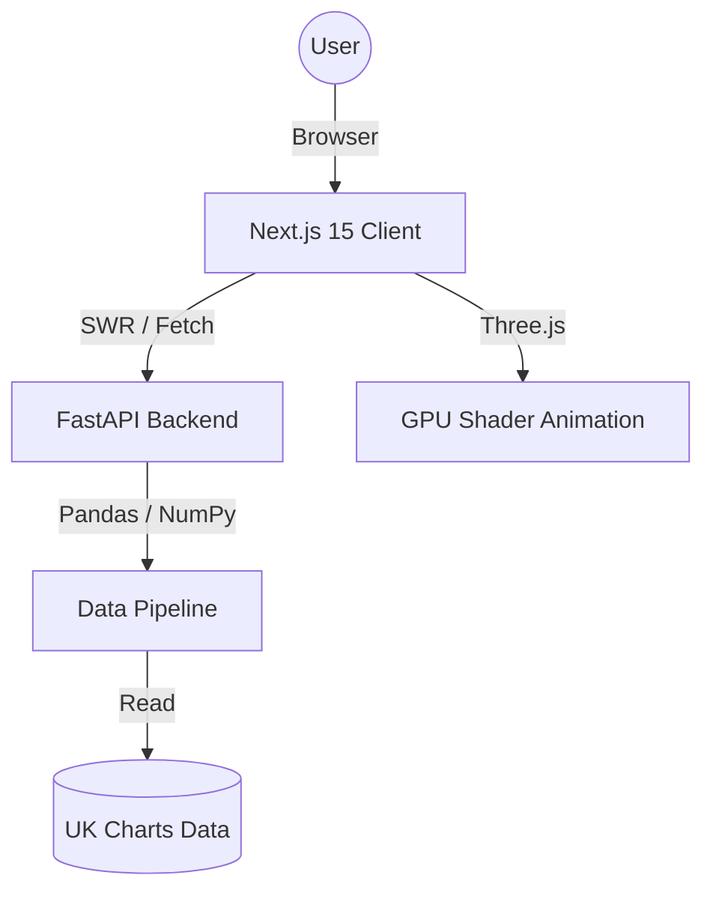

# 🎵 ChartLens: UK Music Charts Analytics

[](https://nextjs.org/)
[](https://fastapi.tiangolo.com/)
[](https://tailwindcss.com/)
[](https://vercel.com/)

**ChartLens** is a premium, high-performance analytics dashboard designed to visualize and decode the trends of the UK Spotify Top 50. Originally evolved from a Streamlit implementation, it now features a state-of-the-art full-stack architecture for sub-second data processing and immersive visualizations.



## ✨ Core Features

*   **⚡ High-Speed Pipeline**: Seamless integration of Python/Pandas data processing with a FastAPI JSON backend.
*   **🎨 Premium UI**: A dark, Spotify-inspired interface featuring **Glassmorphism**, **Framer Motion** transitions, and a **Three.js** shader hero.
*   **📈 Deep Analysis Modules**:
    *   **Artist Dominance**: Gini coefficient calculations and Lorenz curve visualizations.
    *   **Domestic vs International**: Real-time market share comparisons.
    *   **Collaborations**: Metric-driven impact analysis of solo vs. featured tracks.
    *   **Explicit Content**: Prevalence and performance tracking.
    *   **Album Structure**: Correlation analysis between track count and chart longevity.
*   **🎯 Smart Filtering**: Global state management for filtering by date, nationality, and album type.

## 📸 Dashboard Gallery

| Overview Dashboard | Artist Dominance |
| :---: | :---: |
|  |  |

## 🏗️ Architecture



## 🚀 Technical Stack

- **Frontend**: Next.js 15, TypeScript, Tailwind CSS v4, shadcn/ui, Plotly.js, Three.js, Framer Motion.
- **Backend**: FastAPI (Python), Pandas, NumPy, Uvicorn.
- **Infrastructure**: Vercel (Next.js + Python Runtime).

## 🛠️ Local Development

### Prerequisites
- Node.js v18+
- Python v3.10+

### Setup

1.  **Clone & Install Dependencies**:
    ```bash
    git clone https://github.com/Ansiuualt/ChartLens.git
    cd uk-charts-analyzer
    npm install             # Installs root, frontend, and backend bridged deps
    ```

2.  **Environment Setup**:
    Ensure you have your data CSV file in the root or `backend/` directory as specified in `cleaner.py`.

3.  **Run Development Servers**:
    ```bash
    # Run both Frontend and Backend concurrently
    npm run dev
    ```
    - Dashboard: `http://localhost:3000`
    - API Docs: `http://localhost:8000/docs` (if running locally)

---

## 📁 Project Structure

```text
.
├── backend/            # FastAPI Server & Python Analytics Pipeline
│   ├── server.py       # API Entry point
│   ├── pipeline/       # Cleaning & Metrics logic
│   └── *.csv           # Datasets
├── frontend/           # Next.js 15 Client
│   ├── app/            # App Router (Pages & Layouts)
│   ├── components/     # UI Components & Plotly Chart Wrappers
│   └── hooks/          # Custom SWR Data Hooks
├── assets/             # Project Images & Media
├── vercel.json         # Unified Deployment Config
└── package.json        # Root-level bridge for Vercel & Scripts
```

---
Built with 🎵 and ☕ by [Ansiuualt](https://github.com/Ansiuualt)
