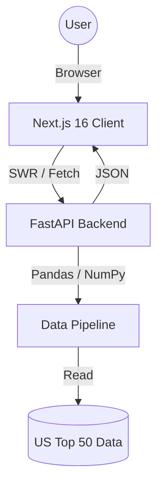

# 🎵 ChartLens — US Spotify Top 50 Analytics

[](https://nextjs.org/)
[](https://fastapi.tiangolo.com/)
[](https://tailwindcss.com/)
[](https://vercel.com/)

**ChartLens** is a premium, interactive analytics dashboard that visualizes performance trends of the **United States Spotify Top 50 Playlist**. It combines a high-speed Python data pipeline with a modern React frontend to deliver deep, real-time insights into song popularity, artist dominance, ranking trajectories, and content patterns.

---

## ✨ Core Features

- **⚡ High-Speed Pipeline** — Python/Pandas data processing with a FastAPI JSON backend for sub-second analytics.
- **🎨 Premium UI** — Dark, Spotify-inspired interface with Framer Motion animations, glassmorphism, and interactive Plotly charts.
- **📊 Six Analytical Modules**:

| Module | What It Shows |
|---|---|
| **Dashboard Overview** | 9 color-coded KPI cards (median days, avg rank, volatility, popularity, Gini index, explicit %) |
| **Timeline Explorer** | Song lifespan bars (cyan gradient) + daily unique songs area chart |
| **Ranking Trends** | Weekly-averaged rank trajectories with HIT/MID/LOW zone bands |
| **Artist Dominance** | Top 20 leaderboard (gold gradient) + Lorenz curve / Gini coefficient |
| **Popularity Scatter** | Rank vs popularity bubbles with regression trendline + quadrant labels |
| **Explicit Analysis** | Clean vs explicit grouped bars + donut chart + stat cards |

- **🎯 Smart Filtering** — Sidebar with searchable Artist/Song multi-select dropdowns, date range, rank range slider, album type, and explicit content toggle.

---

## 🏗️ Architecture



**Data Flow:**
1. `cleaner.py` loads and cleans the raw Spotify chart CSV
2. `metrics.py` computes analytics (KPIs, timelines, rankings, Lorenz/Gini, correlations)
3. `server.py` exposes 7 RESTful endpoints with filter support
4. Next.js frontend fetches via SWR hooks and renders interactive Plotly charts

---

## 🚀 Tech Stack

| Layer | Technologies |
|---|---|
| **Frontend** | Next.js 16, TypeScript, Tailwind CSS v4, Plotly.js, Framer Motion, Lucide Icons |
| **Backend** | FastAPI, Python 3.10+, Pandas, NumPy, SciPy, Uvicorn |
| **Deployment** | Vercel (Next.js + Python Serverless Runtime) |

---

## 🛠️ Local Development

### Prerequisites
- Node.js v18+
- Python v3.10+

### Setup

1. **Clone & Install**
   ```bash
   git clone https://github.com/Ansiuualt/ChartLens.git
   cd uk-charts-analyzer
   ```

2. **Backend**
   ```bash
   cd backend
   pip install -r requirements.txt
   python server.py
   ```
   API runs at `http://localhost:8000` — Swagger docs at `/docs`

3. **Frontend**
   ```bash
   cd frontend
   npm install
   npm run dev
   ```
   Dashboard runs at `http://localhost:3000`

> The frontend auto-proxies `/api/*` to `localhost:8000` in development via `next.config.ts`.

---

## 📁 Project Structure

```text
.
├── backend/
│   ├── server.py                 # FastAPI entry point (7 endpoints)
│   ├── pipeline/
│   │   ├── cleaner.py            # Data loading & cleaning
│   │   └── metrics.py            # Analytics computations
│   ├── Atlantic_United_States.csv  # US Top 50 dataset
│   └── requirements.txt
├── frontend/
│   ├── app/
│   │   ├── layout.tsx            # Root layout + metadata
│   │   ├── (dashboard)/
│   │   │   ├── layout.tsx        # Dashboard shell + hero + sidebar
│   │   │   ├── page.tsx          # Overview (KPI cards)
│   │   │   ├── timeline/         # Timeline Explorer
│   │   │   ├── ranking/          # Ranking Trends
│   │   │   ├── artist-dominance/ # Artist Dominance
│   │   │   ├── popularity/       # Popularity Scatter
│   │   │   └── explicit-analysis/# Explicit Content
│   │   └── about/                # About page
│   ├── components/
│   │   ├── charts/               # Plotly chart wrappers
│   │   ├── nav-sidebar.tsx       # Top navigation
│   │   ├── sidebar-filters.tsx   # Filter panel
│   │   └── kpi-card.tsx          # Color-coded KPI cards
│   ├── hooks/                    # SWR data hooks + filter context
│   ├── lib/                      # API client + types
│   └── public/                   # Static assets (hero.png, profile.png)
├── vercel.json                   # Vercel deployment config
└── .gitignore
```

---

## 🌐 API Endpoints

| Endpoint | Description |
|---|---|
| `GET /api/meta` | Available artists, songs, album types |
| `GET /api/overview` | KPI summary (9 metrics) |
| `GET /api/timeline` | Song lifespans + daily counts |
| `GET /api/ranking` | Rank trajectories for selected songs |
| `GET /api/dominance` | Artist leaderboard + Lorenz/Gini |
| `GET /api/popularity` | Popularity vs rank scatter data |
| `GET /api/explicit` | Explicit vs clean performance stats |

All endpoints support query filters: `date_start`, `date_end`, `explicit`, `album_types`, `artists`, `songs`, `rank_min`, `rank_max`.

---

## 🚢 Deployment

The project deploys to **Vercel** as a unified monorepo:

- **Frontend** — Built by `@vercel/next` from `frontend/package.json`
- **Backend** — Runs as a Python serverless function via `@vercel/python`
- **Routing** — `vercel.json` rewrites `/api/*` to the Python backend

Push to `main` and Vercel auto-deploys.

---

Built with 🎵 and ☕ by [Anshuman Maharana](https://github.com/Ansiuualt)
